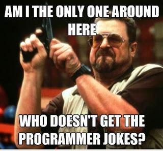

Want to read it on my Blog instead? : [link](https://thebeginnercoder.blogspot.com/) 

There are times when you think you want to boast about your knowledge, if not always that is.But apparently this is not the case with my limited spectrum at present .So college has started and on a seemingly arduous note, except for one little piece of joy,computer science, my major.

I remember my first week, so elated i was that I was about to attend my first few lectures of Computer science.The feeling didn't last its course as the week progressed, because what used to appear to me as the epitome of logic, kept drifting away to a sordid dream of learning the syntax(the coding language) -.-

To add to my misery was the fact that almost everyone i knew had some prior idea of the subject so were trying to implement their ideas via codes while i was stuck in the nuisance of symbols, which apparently did not connect with each other in any way possible.I remember people laughing at each other's faults of having written the code twice instead of using recursion, while i just, well sat.-.-

Then i was referred to a book.For a guy who loves reading introspective novels, this book didn't seem to just be a novelty.

I started reading it, underlining almost every second line,finished a couple of chapters and felt satisfied as even though through theoretical stance at least i left the shore.But would the next certain minutes turn out to be a storm, well who would have thought, because as i turned back to see exactly how much had i covered

, i was surprised to the realization that the real thing hadn't even started by then.

But today, after about two months into the course, if you ask me how depressed i am, I would laugh so hard, because contradictory to what i wrote earlier, computer science is most definitely the epitome of logic!!

It follows the same procedure of starting with the basics and making your way through.I know what i am going to say is too overrated but trying to do computer science is just like trying to learn a different language,literally too!!!well hello, programing LANGUAGE!!

So you start by mugging some basics, even though how boring that may be, be patient. Practice some existing examples in your reference book, even though the stupidest thing it may seem to do, do try and copy the same code onto your machine and let it run, literally.Because it is very important for your brain to witness ,how a sensible input can produce another sensible output!!

Over time you will realize things actually begin to fall in place, and the atrocious symbols that you once thought weird would seem to be quite sensible objects of representation.

Once you have crossed a certain threshold of knowledge base, you may let your imagination at work and create anything and everything.I know I have used this word incessantly , but wouldn't hurt to use it just one more time, right? so yeah 'Literally anything!!' It is simply overwhelming and fascinating, to get the power to create.I am in love with each of the programes i write, even the ones that do not work, and trust me that is a big,big list.

 I don't know if this is me just being optimistic but I now see not knowing to code beforehand, as an added advantage, as it is keeping my searching skills alive and giving me no attitude threshold to maintain.

Thank you for reading, hope to see you soon

Rishabh Gupta
