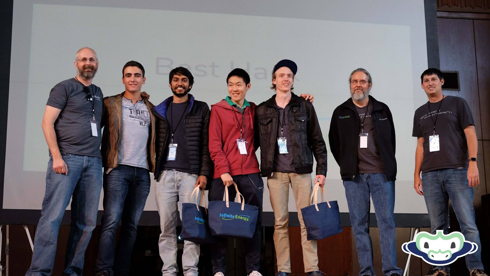
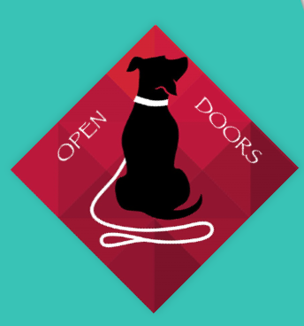
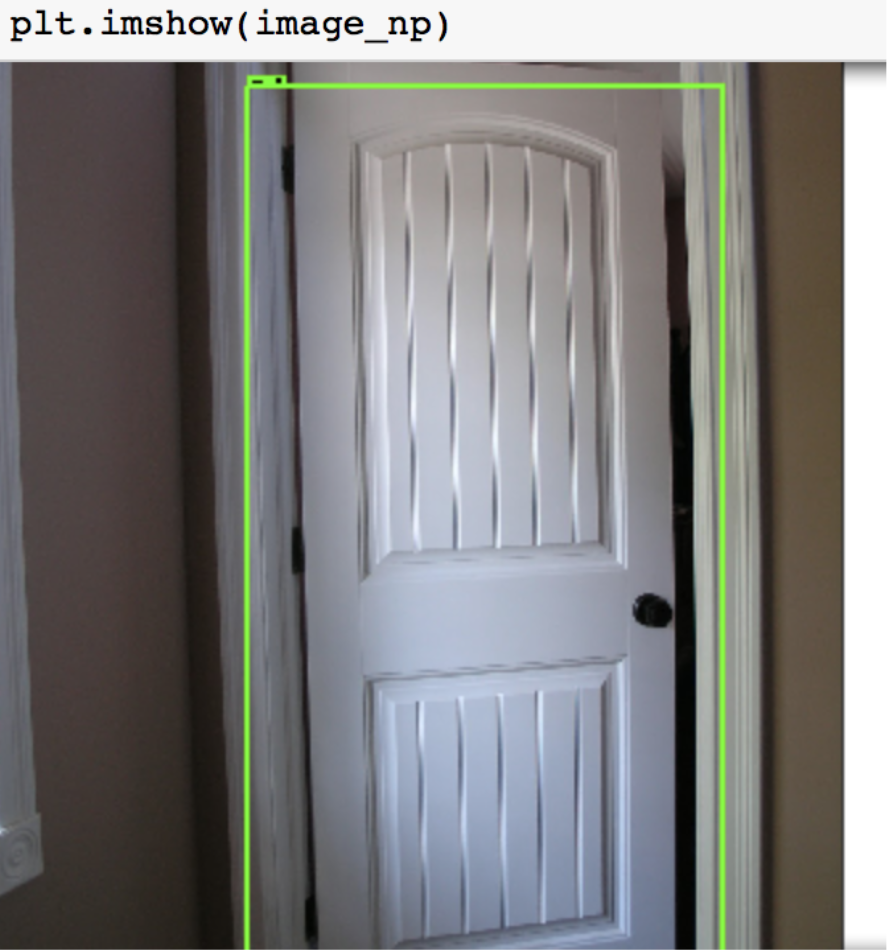
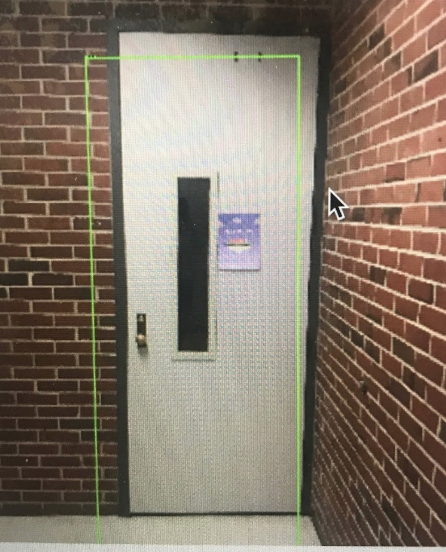

  
  
  

## Inspiration
Hackathons have always been about getting together with a group of like-minded people and trying to create something new that hasn't been done before. While most ideas are born through careful research, planning, and brainstorming, this idea was born out of a real necessity in this world. From the start, our team knew that we wanted to make something that would help blind people navigate the world using computer vision. Using this basis, we formulated the idea into a more concrete plan and decided that we would focus on a specific, yet important, problem that blind people face on a daily basis.

## What it does
Our application aims to serve as a visual aid for the blind, making them more aware of their surroundings through real-time analysis of their phone's camera feed. We're tackling the huge stimulus from the world one object at a time, and to lay our groundwork, we've selected the task of recognizing doors. 

When the phone is pointed towards any direction, it vibrates if it senses a door in its path.
## How we built it
None of us had ever met each other before, we formed the team via the slack channel of Swamp hacks, with each one bringing their own special skill-set to the table. We had a rough idea of the direction we wanted to head into, but it was through various brainstorming sessions with the mentors, discussions about dev-ops and accessibility centered design that we iteratively kept tweaking and improving our idea.

For the dev-ops, we initially worked out a pipeline that we would follow, with timed deadlines to keep us grinding. We divided ourselves into two sub-groups where two people tackled the computer vision and the machine learning aspect of it and the other two worked on setting up the server-side and client-side infrastructure. 

Instead of leaving the merging of the two worlds for the end, we decided to go forth with periodic integrations, so that we don't compromise on our product due to stress by the end. 

## Challenges we ran into
Getting the machine learning models to an acceptable level of accuracy was a challenge, and required training and testing of a lot of different models.
Data for learning was another issue, but we managed to find some good data-sets, and for specific applications went, through Marston to generate our own data, and manually label it too.
Making the server interact with the client, when dealing with real-time image feed posed to be a big challenge as well.

## Accomplishments that we're proud of
We're proud of the hard work and the collective team-effort that we put into this project.
We're proud of the tremendous amount of research we got to go through  this project, regarding dev-ops and primarily regarding accessibility,

## What's next for OpenDoors
The next step for OpenDoors is already in the development phase and very specific, where we plan to inform the user about the different types of doors(for operational purposes), bathroom signs. In addition, we can use complex facial recognition and analysis techniques to help give blind people context in social situations that they would not have otherwise had. For example, we could scrape their social media profiles to learn the faces and names of people they know and love. Then, we can provide situtational awareness by informing them when it detects one of those faces.

Project [powerpoint presentation](https://docs.google.com/presentation/d/1vI8OxTr2I2iy9ValWcKdyY1Iip29E1QNxm0o2dIMrqw/edit?usp=sharing)
Project Devpost: [SwampHacks Devpost](https://devpost.com/software/opendoors).
