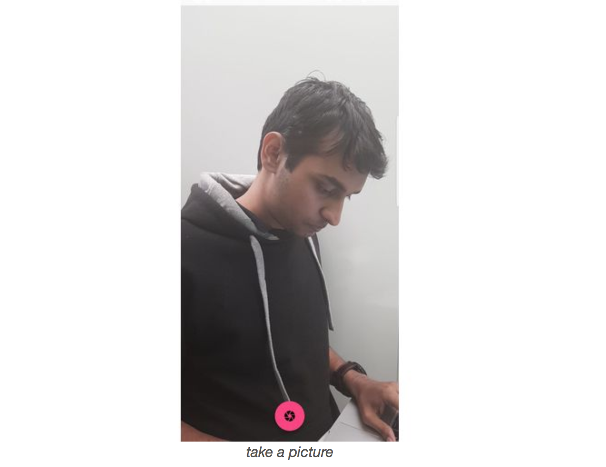
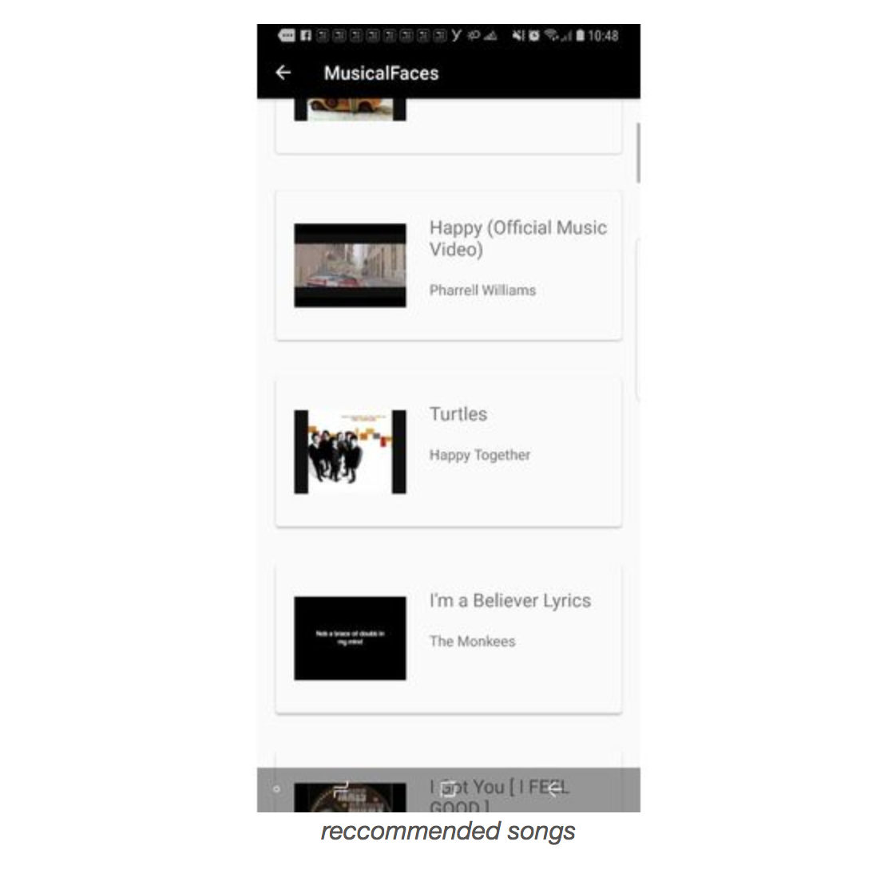

## Application flow: 

  
  
  
  
  
  

# musicalfaces

Project [Video Link](https://youtu.be/wetPkyiPhww)

Our project musicalfaces is a step to bridge the gap between visual and sonic stimulus. 

We base our project on two primary premises
- we express extensively through our facial features
- and we are slave to the rhythem of the music !! (YAY!)

In times of need when we are feeling low, sad or depressed ,one uplifting song can make us feel better, then be it one that we've never listened to before, and on the contrary , when we are feeling on top of the world, a song about heart-break can possibly bring back spikes of pain.

Now imagine, your sitting with someone , and you can just whip out your phone , take a picture of their face and get to know how they are felling, and in addition you can help them to make them feel better by playing a recommended song for their emotion.

And now also imagine that one of your close friend is wayyy happy that they are supposed to be, imagine now that you can bring them down to the ground reality, by contradicting their emotion by a recommended opposing emotion song, might come pretty handy, eh? ;D

Tech specs
Android application, android sdk
Microsoft vision API: https://azure.microsoft.com/en-us/services/cognitive-services/computer-vision/
Microsoft Azure emotion API: https://azure.microsoft.com/en-us/services/cognitive-services/emotion/
Microsoft Azure face API:https://azure.microsoft.com/en-us/services/cognitive-services/face/
Youtube data v3 API: https://developers.google.com/youtube/v3/

Project Devpost: [SwampHacks Devpost](https://devpost.com/software/opendoors).
