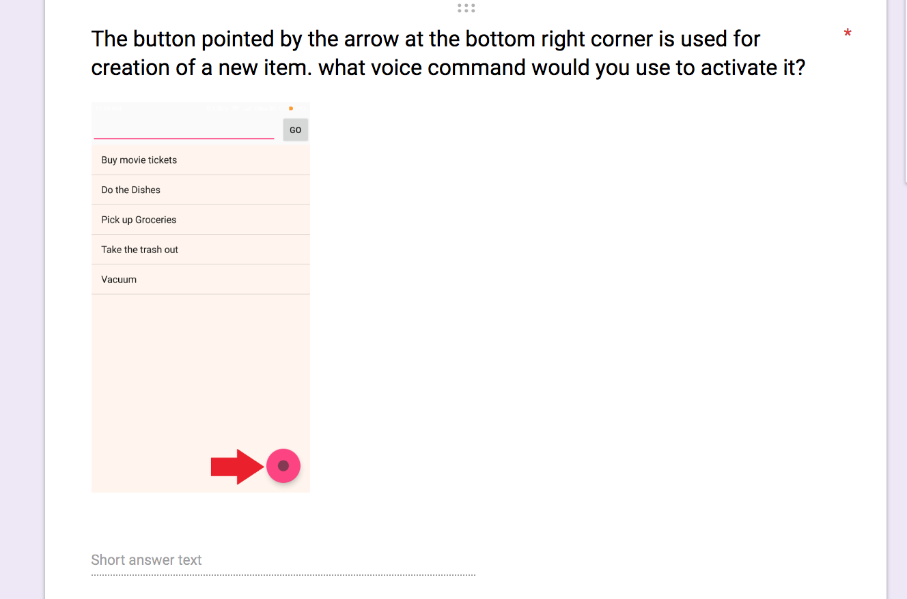
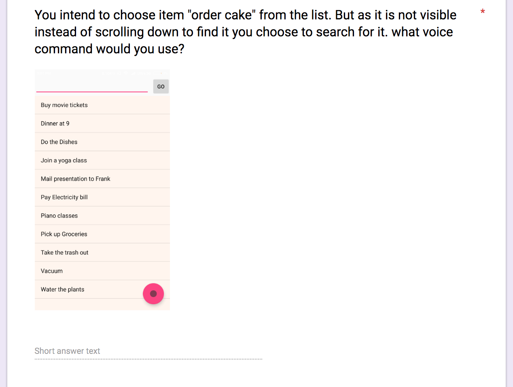
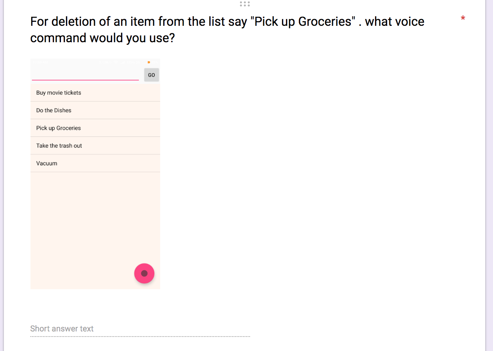

Enjoy a detailed walkthrough through our developed application: it's use cases and demo!

App [Video Link](https://www.youtube.com/watch?v=oFvKx148R0E)

Friday - the task organiser was developed as part of the course CEN5726: Natural User Interaction

## How we developed 'Friday'

User survey: [User survey link](https://docs.google.com/forms/d/14Z8ojrB_L2o6NfSiPg_PTUCGWdoFgKKl_jc2LB8gmLY/edit)

This application was developed by conducting extensive user study to learn the various ways users would interact with a task organiser application. It was based on the gestural as well as the speech interactions a person may do to perform a task.
A whole new dictionary of keywords for speech recognition was created specifically for the app, to take care of the interactions made by general/average user.

## Conducting the user study
User Study presentation : [User study persentation link](https://docs.google.com/presentation/d/1oGPNu3mvny32ylAmwHBT37zBb4viN44Dky4AwqEJ7Mo/edit#slide=id.p)

Users were asked to interact with a prototype of the app, and asked several questions based on their interactions.
Another set of users were sent an online survey to fill out, which had questions like:-

## Eventually all the pieces were put together and Friday was born!
