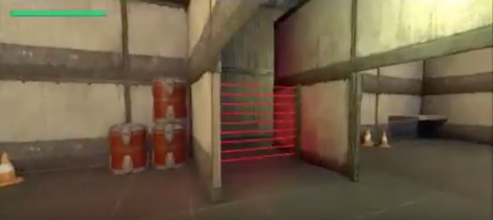
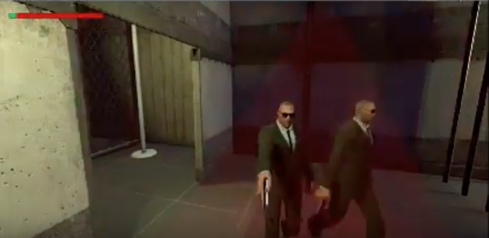

## Idea
* Stealth gameplay 
* Spy game
* First Person

Project [Video Link](https://www.youtube.com/watch?v=HOaqC1x4dZk)

## Story
Retired spy
* Friend approaches you one day asking for your help on one last job
* Go to a low security area (maybe hotel) and your friend walks you through how to play the game
* At the end of the tutorial level, you realize the vault is empty and then your friend is grabbed
* You barely escape and then decide to gather intel to find your friend
* Next go to a high security area (main level we have created) to find intel
* You break in and steal some intel, but an alarm sounds
* You escape onto the roof and then get in a helicopter
* As you’re flying away, you say that “Nothing will stop me from finding you” and then suddenly the helicopter is shot and explodes
* The scene fades in from black on a parachute draped over a tree and then you see the character start walking toward the camera
* He says “Nothing” one last time as he walks away and the scene cuts to black
* Fin

## Levels
* Level 1 - Player starts in a maze, where he has to escape while being careful not to be spotted by hoverning security drones.If spotted, the drones take the player back to the original starting point, i.e. outside the facility

* Level 2 - There are human NPCs(Non player characters) patroling various sections of the level, and player has to get past them to reach the elevator shaft. All the patroling guards have the ability to shoot the player and drain their health.

* Level 3 - Player has reached the top of the facility, and now should escape after getting the key-codes to save his friend. As soon as the player reaches for the key-Codes, an alarm sounds, and a whole army of guards comes towards the player. He has seconds to pull of the final stealth escape --> "Hint: one of the vent-ducts seems open"

* Level 4 - Player escapes using the helecopter ---> The end!!

## AI (types and respective powers)
Normal Guard
* Patrol (PathFinding)
* Shoot Player (Dead Reckoning)

Drone
* Patrol Maze (PathFinding)
* Lift Player and return to start of maze (Trigger)

Cameras
* Rotate and search using vision cone
* Set off alarm and track player (Trigger)

Lasers
* Set off alarm and update player location (Trigger)
* Disable Paths

## Preface through tutorial
* Rachel: Hey, it’s been a long time. How’s retired life been treating you? Not getting bored of lounging by the beach? Listen, I have a favor to ask of you. I’m looking into this shady group that’s calling themselves The Organization and could really use your help in the field. You were the best spy in the business and I can only trust you with this intel. Could you help me out with this one for old times sake?

Tutorial level
Displayed text in tutorial:
* Rachel: Thanks for agreeing to help me out. This should be a walk in the park for you.
* Rachel: It looks like they haven’t cleaned this place in years! You’ll have to climb your way through to reach the safe room. (Hold “left shift” or “L2” to sprint) (Press “space” or “x” to jump)
* Rachel: That crate is in the way, you’ll have to crouch under it. (Press “ctrl” or “circle” to crouch)
* Rachel: Oh no, the door is locked! They might have left the key around here somewhere. Take a look around and see if you can find it.
* Rachel: You better not let that camera see you. If it does, it will sound the alarm and alert any guards in the area.
* Rachel: That guard doesn’t look too friendly. Make sure he doesn’t see you while you’re sneaking by.
* Rachel: This is it. It looks like we’ll need a password to get into the safe room. Maybe they left it on that table… (Press “e” or “square” to interact with devices)
* Rachel: It was a trap! The guard knows where you are now. Quick, hide under that table and wait for him to leave! (Press “ctrl” or “circle” to crouch)
* Rachel: It’s empty?? That doesn’t make any sense! It’s like they knew we were coming…
* Rachel: You better get out of there before something else happens. I think I saw a crate on the roof that you can use to get back over the wall…
* Rachel: Wait, I hear something. There’s someone outside my room. Oh no, it’s them! Help me plea- *Static*

Text explanation after tutorial
* Me: I can’t believe they kidnapped Rachel… I’ve got to rescue her before it’s too late. I’ve heard rumors that The Organization has a base to the west. Maybe I can find some intel on her there?
End game text
* Me: I’m coming Rachel. And nothing is going to stop me...

Finalize Safe Level
Helicopter
* Ending monologue: “Don’t worry, I’ll be there soon and nothing’s gonna stop me… Nothing.”

## Tutorial
* Player crouches to get into warehouse
* Player must jump to reach platform where password is
* Player must hide behind objects to avoid guards
* Player must avoid camera search rays
* Player activates booby trapped alarm when typing in code and must hide under nearby table until guards leave

## Sources/Assets
Stealth Sample Project - https://www.assetstore.unity3d.com/en/#!/content/7677
Body Guards 3D Character Models - https://www.assetstore.unity3d.com/en/#!/content/31711
Hangar Scene - https://www.assetstore.unity3d.com/en/#!/content/20040
Scifi Enemies and Vehicles - https://www.assetstore.unity3d.com/en/#!/content/15159 
(Maybe, if used - otherwise delete) Machine Exploration SFX - https://www.assetstore.unity3d.com/en/#!/content/60151
PM-40 Gun - https://www.assetstore.unity3d.com/en/#!/content/51604
Corridor Lighting Example - https://www.assetstore.unity3d.com/en/#!/content/33630
Dark Future Music - https://www.assetstore.unity3d.com/en/#!/content/3777
Base Helicopter Controller -
	https://www.assetstore.unity3d.com/en/#!/content/40107
