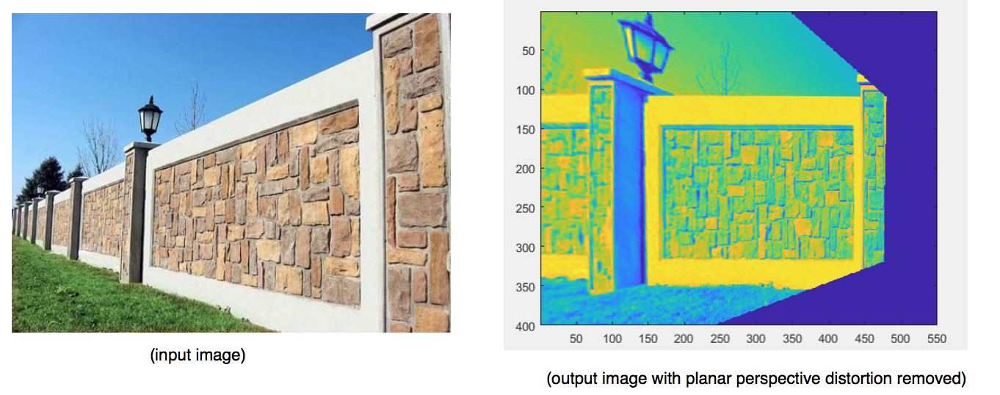
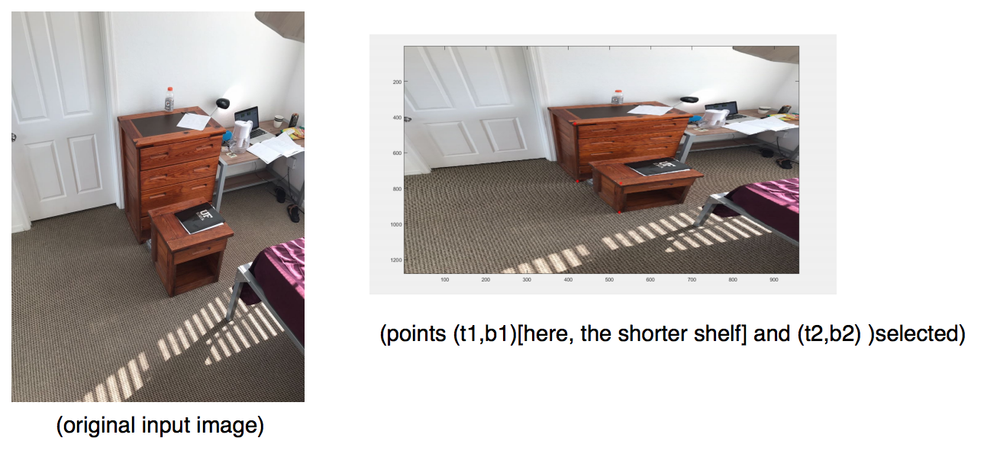
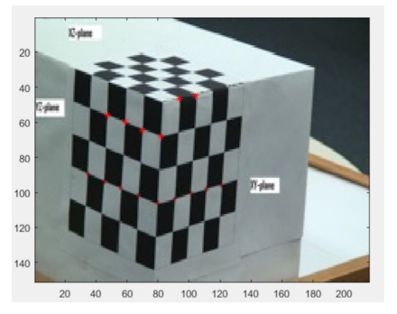
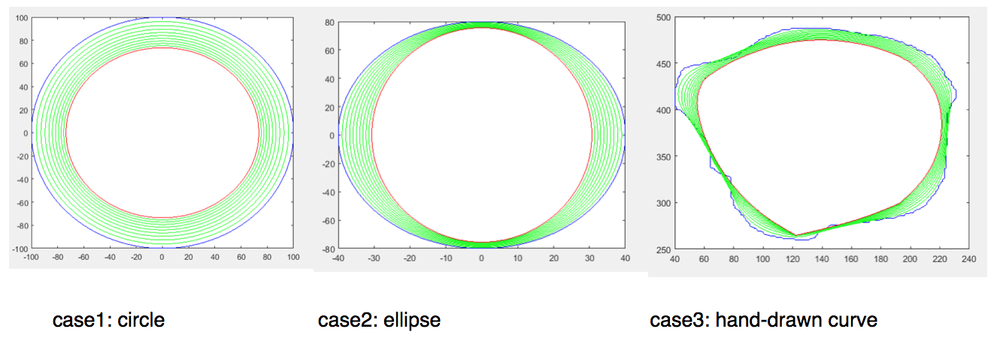
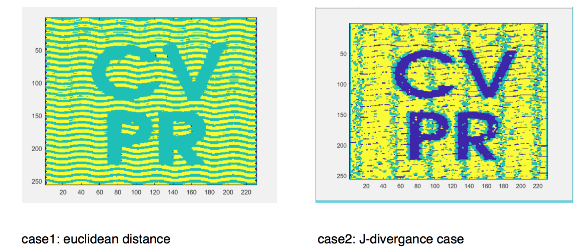
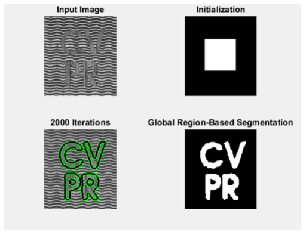
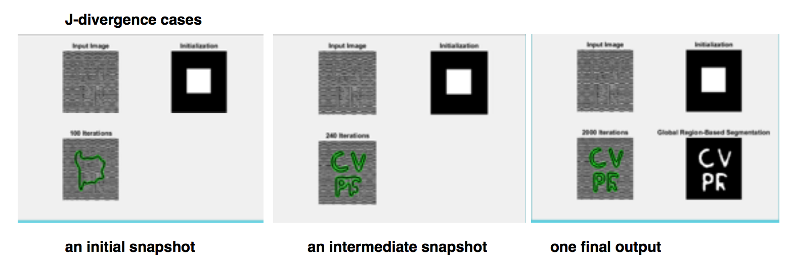
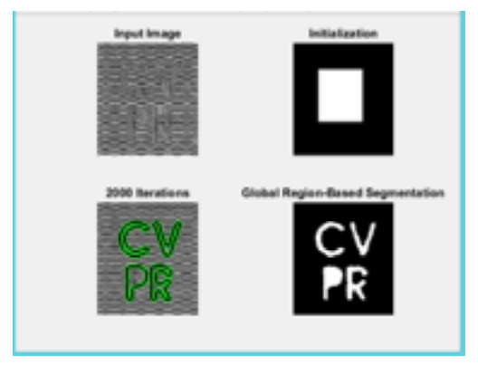

# ComputerVision

## compute homographies and removing planar perspective distortion from any image

* homography with 8 degrees of freedom can be used for projective geometry and removing planar
perspective distortion.
* To do so, 8 equations are required. Each point correspondence gives two equations, Hence
homography matrix H can be fully computed using 4 point correspondances
* While applying this forward transformation xPrime = Hx and mapping points from the original
image to the output image , there may be a problem of indices lying in between pixels. This can
be solved using bilinear interpolation and doing a reverse mapping where we think ‘from where
does every point in the output image come from the input image’
* Mapping an image coordinates to an array is a bit tricky because x’s map to columns and y’s
maps to rows here

## Compute Real World Height Ratios of objects (uses vanishing points and vanishing lines)

*  vanishing points can be computed by either taking out the point of intersection of equations of parallel(in real world) lines in the image plane, OR
by considering the planes formed by their homogeneous representations and taking their intersection, which will give a ray which would intersect the image plane at the vanishing point in euclidean coordinates

## Compute Camera Caliberation parameters and all internal variables

* let M be the caliberation matrix,computing A from Image = M*Real, such that A*m(i.e.column vector M) =0, so that I can use SVD of A and get the vector c from it's null space
* M = [m1 m2 m3 m4;m5 m6 m7 m8; m9 m10 m11 m12], and m=[m1,m2,m3,...,m11,m12] taking out other parameters
M = (KR|KRT) = (E|ET), K=internal parameter matrix, R = rotaition matrix,T = Translation matrix

## Curvature Flow Equation 

* applying the curvature flow delC/delt = -k.n to a curve, and allowing it to shrink

## Structure Tensor based modified K-means

* does segmentation of images using structure tensor based aproach to K-means , using form parameter as distance type (J-divergance and eucliidean distance) 

## Structure Tensor based Level Sets based Segmentation of Textured Images

* Implemented the paper "An Affine Invariant Tensor Dissimilarity Measure and its Applications to Tensor-valued Image Segmentation ?" (structure tensor and J-divergance based segmentation on top of chan-vesse algorithm)

* Euclidean distance case

* J-divergance case

* What I have seen through the results and implementation
Tensor-based K-means segmentation as opposed to the Tensor based Chan Vesse bases the segmentation only on data without using a regularising term and hence it has a very high probability to throw out a very crude , not so smooth segmentation when compared to tensor based chan-vesse level sets formulation

Project [Github repository link](https://github.com/mlzepplin/ComputerVision)
